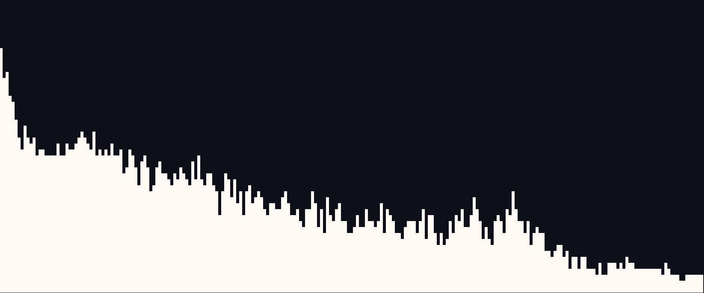
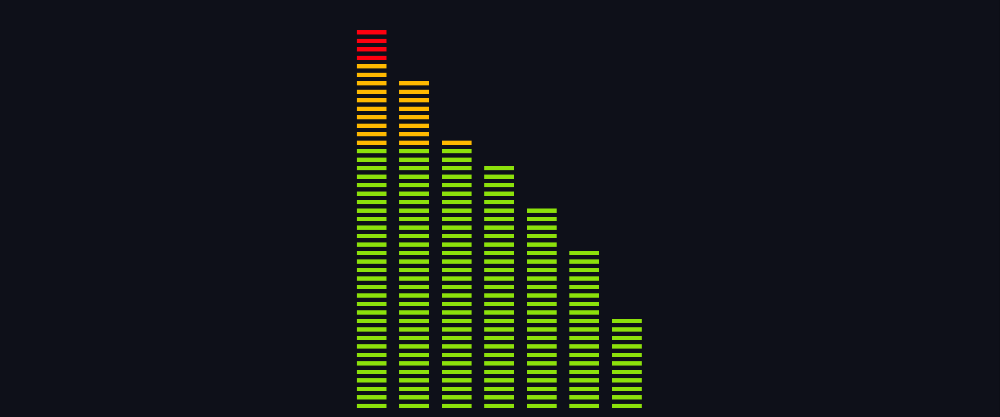

# SoundVisualiCer

**SoundVisualiCer** is a real time audio spectrum visualizer similar to cava.


## Introduction
- **PulseAudio** captures live audio stream
- **FFTW3** performs FFT on the sampled audio stream
- **ncurses** visualizes the FFT output in the terminal

## Usage
- Color Switching by pressing 'c'
- Style Switching by pressing 'p' or 'n'
- Quit by pressing 'q'

## Setup

### 1. Install Dependencies

#### On Ubuntu/Debian
```Terminal
sudo apt update
sudo apt install libncurses-dev libpulse-dev libfftw3-dev
```
### 2. Build

- Modify the source device in "src/pulse.c"
```c
static const char *device = "YOUR_DEVICE_NAME";
```
- You can list available audio sources by running:
```Terminal
pactl list sources short
```
- Make
```Terminal
make
```
### 3. Run Application

```Terminal
./soundvisualicer
```

## ToDo
- [ ] Make pulseaudio automatically adjust to the current audio source
- [ ] Implement different styles
- [ ] pack different draw styles in seperate .c ?

## Audio Setup
Currently working:
- PulseAudio

Other Options:
- ALSA
- PortAudio
- JACK

### Division of Spectrum
- 7 Sections
    - Sub Bass         20 to    60 Hz
    - Bass             60 to   250 Hz
    - Low Midrange    250 to   500 Hz
    - Midrange        500 to  2000 Hz
    - Upper Midrange 2000 to  4000 Hz
    - Presence       4000 to  6000 Hz
    - Brilliance     6000 to 20000 Hz

## Style Showcase

### Default Style



### Basic Bar Style


### Colored Bar Style

